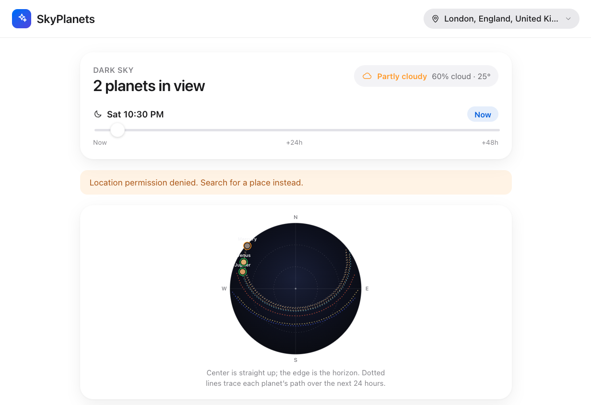
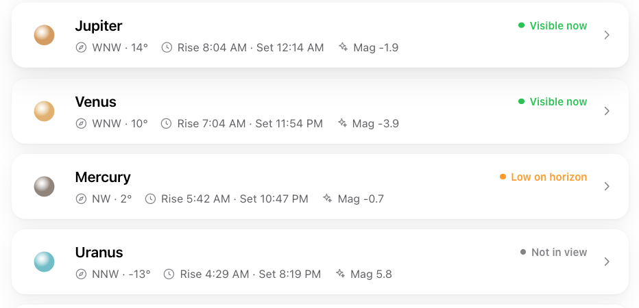

# SkyPlanets

**See which planets are visible from your location, right now.**

SkyPlanets is a web app that tells you which planets are above the horizon
tonight, where to look for them, and when they rise, peak, and set. It combines
your location, the current time, and astronomical calculations to answer one
simple question in plain language: *what can I see in the sky right now?*



## What it does

- **Planets visible now** — a live list of Mercury, Venus, Mars, Jupiter,
  Saturn, Uranus, and Neptune, sorted by how easy each one is to spot.
- **Interactive sky map** — a circular dome view where the center is straight
  up and the edge is the horizon. Each planet is plotted by its real altitude
  and compass direction, with dotted trails tracing its path over the next
  24 hours.
- **Time scrubber** — drag through the next 48 hours to see how the sky changes,
  or tap **Now** to jump back to the present moment.
- **Plain-language guidance** — every planet shows its direction (e.g. *WNW*),
  altitude, rise/set times, and apparent magnitude, with a clear status badge.
- **Weather context** — a cloud-cover badge tells you whether the sky is
  actually clear enough to observe.



## Visibility status

Each planet is classified using its altitude and the Sun's position:

| Status | Meaning |
| --- | --- |
| **Visible now** | Above 10° and the sky is dark (Sun below −6°) |
| **Low on horizon** | Between 0° and 10° in a dark sky |
| **Not in view** | Below the horizon, or the sky is too bright |

## Tech stack

- [React 19](https://react.dev/) + [TypeScript](https://www.typescriptlang.org/)
- [Vite](https://vite.dev/) for development and bundling
- [astronomy-engine](https://github.com/cosinekitty/astronomy) for topocentric
  planet positions, rise/set, and magnitude calculations (computed locally in
  the browser)
- [Open-Meteo](https://open-meteo.com/) free APIs for geocoding (city search)
  and cloud-cover weather — no API key required

## Getting started

```bash
# install dependencies
npm install

# start the dev server
npm run dev

# build for production
npm run build

# preview the production build
npm run preview
```

The app opens at the URL printed by Vite (typically `http://localhost:5173`).

## How it works

1. SkyPlanets requests your location (with consent). If you decline, you can
   search for any city instead.
2. For the selected location and time, it calculates each planet's altitude and
   azimuth locally using `astronomy-engine` — no observing data leaves your
   device.
3. Results are presented as a sky map and a ranked list, with weather pulled
   from Open-Meteo for observing context.

## Privacy

Your location is used only to compute planet positions and fetch local weather.
Coordinates are not stored on a server.

> Visibility ignores local terrain and obstructions (buildings, hills, trees).
